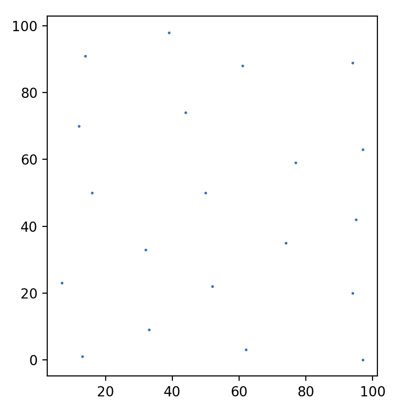
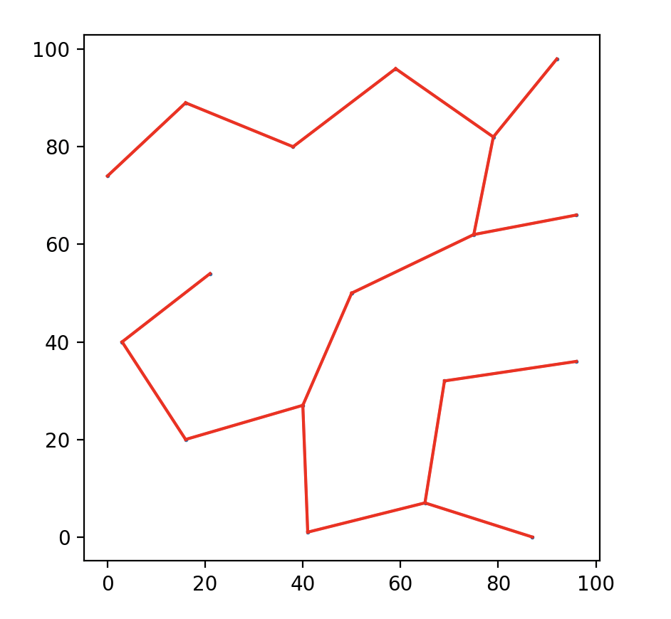
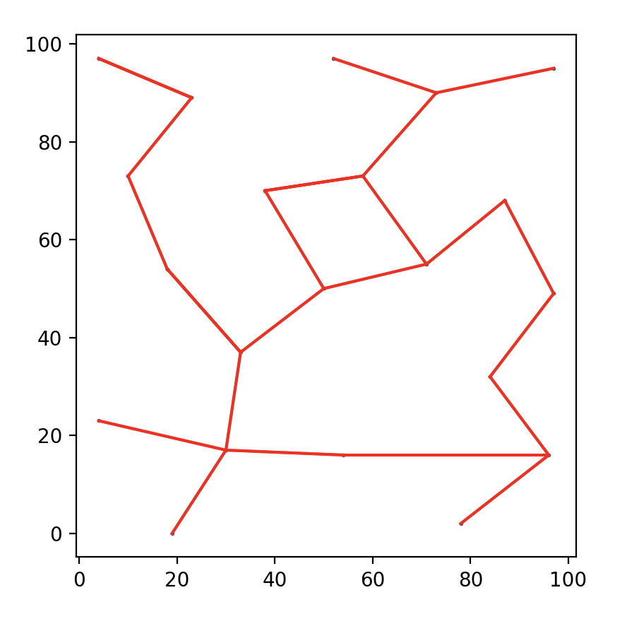

# _Hornvale_::Specification

A semi-formal specification of Hornvale.

Rather than getting bogged down in implementation details immediately, I want to declare this idea [^1] in some kind of coherent, unambiguous fashion. You know, so I can just _write_ what I want instead of having to specify ownership semantics.

## World

The Game World can be modeled as a directed graph **_G_ = (_V_, _E_)** where:

- _V_ is a set of vertices, with each vertex _v_ ∈ _V_ representing a region in the game.
- _E_ is a set of edges, with each edge _e_ ∈ _E_ representing a passage between regions. An edge is an ordered pair (_v__i_, _v__j_) indicating a passage from region _v__i_ to region _v__j_.

### World Seed

Each world is generated by a distinct seed value, the **World Seed**, which determines pseudorandom number generation through each of the subsequent layers of the world structure. Specifics of this are implementation details.

### Graph Generation

Vertices are generated on an infinite unit cartesian coordinate plane.

The initial vertex is always generated at (0, 0). It is given a seed value, a **Region Seed**, equal to that of the World Seed.

We expand outward, adding new vertices, using a discretized version of Bridson's algorithm (see [reference implementation](./bridson.py) and [example](./bridson_example.py)).

We connect the vertices into a minimum spanning tree using Prim's algorithm, which seems to be well-suited to incremental growth (see [reference implementation](./prim.py) and [example](./prim_example.py)).

Then we can randomly add cycles (see [reference implementation](./add_cycles.py)).

This can easily generate more regions than anyone could explore, but we can modify these algorithms to expand incrementally in the direction of exploration.

## Vertex/Region

Each vertex is given a seed value equal to the World Seed modified by its own _x_ and _y_ coordinates (specifics are an implementation detail; this could be just concatenating the world seed and the _x_ and _y_ coordinates and hashed, or ( _W_ + _A_ ⋅ _x_2 + _B_ ⋅ _y_3 ) mod _M_ where _A_ and _B_ are prime numbers and _M_ is a very large prime number close to `INT_MAX`, etc).

### Juice and Chunk Loading and Unloading

Each vertex corresponds to a region of the game world. The world is infinite but our hardware is not; consequently, we must use a chunk management system to determine how to direct computing resources to the world. This leads us to a concept of "juice," which is an attempt to model the engagement and interest of the player in a given region, and use that to determine how computing resources are allocated.

We can describe _Jcurrent_, the total current juice of the region, as follows:

- _Jcurrent_ = _wproximity_ ⋅ _Jproximity_ + _wlinger_ ⋅ _Jlinger_
  - _wproximity_ is some fractional weight for the proximity factor
  - _wlinger_ is some fractional weight for the lingering factor
  - _Jproximity_ (_d_) = _J0_ ⋅ _e-λd_
    - _Jproximity_ (_d_) is the juice level at distance _d_
    - _J0_ is the juice level at the player's location
    - λ is the decay constant, determining how quickly the juice level decreases with distance
    - _d_ is the distance from the player’s current position.
  - _Jlinger_ (_t_) = _L_ ÷ ( 1 + _e-k(t - t0) _ )
    - _Jlinger_ (_t_) is the juice level at time _t_
    - _L_ is the maximum juice level
    - _k_ is the steepness of the curve, determining how quickly the juice level falls off
    - _t0_ is the time at which the player leaves the region, serving as the midpoint of the sigmoid curve

If _Jcurrent_ falls below some threshold value _Jmin_, the region is declared to be effectively devoid of interest and can be unloaded until such a time that its juice once again exceeds that threshold.

The following visualization simulates these changes to _Jcurrent_; the character moves between chunks, and chunks are loaded (invisible -> visible) and are unloaded (visible -> invisible).

### More Fun With Juice

In addition, we can also monitor a longer-term cumulative trend:

- _Jengagement_ = _Jengagement_ + Δ _J_ ⋅ _t_
  - _Jengagement_ is a cumulative measurement of how much a player has engaged with a region.
  - Δ _J_ ⋅ _t_ is a measure of how much the juice has changed this turn. This will always be at least zero, though it may be rounded down to zero judiciously.

And we can compare the current state to that historic trend:

- _Jdecay_ = _Jengagement_ ⋅ _e-λ(t - t0)_
  - _Jdecay_ is an indicator of how much a player has engaged with a region _recently_
  - λ is the decay constant, determining how quickly the juice level decreases with time since last engagement
  - _t0_ is the time at which the player last interacted with the region

This can be used as a trigger for "hey, remember me?" type events.

[^1]:  "You can't just say that your game exists."
  "I didn't say it. I _declared_ it."
